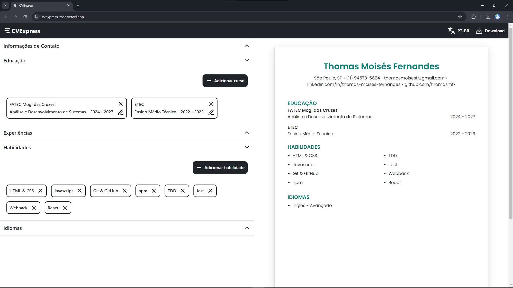

# CVExpress

A simple and intuitive resume generator!

Deploy: [cvexpress-rose.vercel.app](https://cvexpress-rose.vercel.app/)



## Description

**CVExpress** is a web application that allows users to easily create a personalized and ATS-friendly resume. It was developed focusing on simplicity, being the ideal option when it comes to creating a profesional resume in a matter of seconds.

## Features

- Create resumes with personalized information.
- Real-time preview of the resume as you fill in the details.
- Export the resume in PDF format, totally ATS-friendly.
- Modern and responsive interface.
- Available in English and Portuguese.

## Technologies Used

- HTML & CSS
- Javascript
- React
- Vite
- pdfmake (library)

## Installation

1. Clone the repository

```
git clone https://github.com/thomasmfx/cvexpress.git
```

2. Navigate to the project directory:

```
cd cvexpress
```

3. Install the dependencies:

```
npm install
```

4. Start the application:

```
npm run dev
```

Then open the outputed port!


